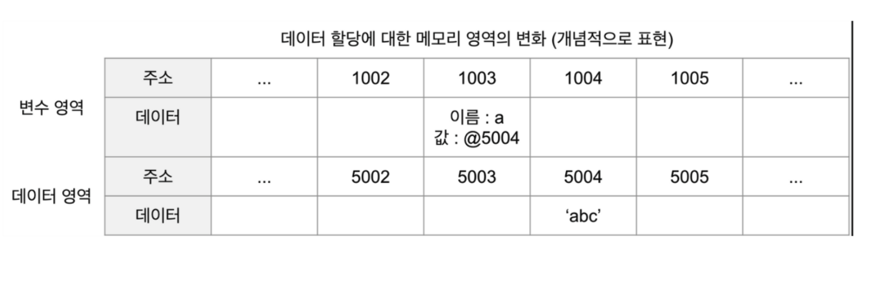

# 데이터 타입

## 데이터 타입의 종류

JS에서는 크게 두 가지의 타입이 존재

### 기본형(원시형) 타입(primitive type)

- 숫자(number), 문자(string), 불리언(boolean), null, undefined, 심볼(ssymbol)

- 기본형은 값이 담긴 수솟값을 바로 복제

### 참조형 타입(reference type)

- 객체(object), 배열(array), 함수(function), 날짜(Date), 정규표현식(RegExp)
- 참조형은 값이 담긴 주솟값들로 이루어진 묶음을 `가리키는 주소값`을 복제

  

## 데이터 타입에 관한 배경지식


1바이트는 8개의 비트로 구성와어 있고 0 또는 1 의 두 가지 값을 표현 할 수 있음
즉, 1바이트는 256(2의 8승)개의 값을 표현 할 수 있음

자바스크립트는 숫자의 경우 정수형인지 부동소수형인지 구분하지 않고 `64비트, 즉 8바이트를 확보`한다. 모든 데이터는 바이트 단위의 식별자, 정확하게는 `메모리 주솟값`을 통해 서로 구분한다

## 식별자와 변수

변수와 식별자를 혼용하는 경우가 많다.
문맥에 따라 무엇을 말하고자 하는지 유추가 가능하지만 둘의 차이점은 명확히 알고 있어야 한다.

### 변수

- 변할 수 있는 무언가
- 여기서 무언가는 `데이터`를 의미

### 식별자

- 어떤 데이터를 식별하는데 사용하는 이름
- `변수명`을 의미

## 변수 선언과 데이터 할당

### 변수 선언

```js
var a;
```

위의 코드를 풀어 쓰면 `변할 수 있는 데이터를 만든다. 이 식별자는 a로 한다. 라는 의미가 된다.

변수란 결국 `변경 가능한 데이터가 담길 수 있는 공간 또는 그릇`이다


위에서 명령을 받은 컴퓨터는 메모리에서 비어있는 공간 하나를 확보한다.
위에서는 임의로 1003번으로 정했고 이 공간의 이름(식별자)을 a라고 지정한다.

여기까지가 변수 선언의 과정이다.

이후에 사용자가 a에 접근하고자 하면 컴퓨터는 메모리에서 a라는 이름을 가진 주소를 검색해 해당 공간에 담긴 데이터를 반환한다.

### 데이터 할당

```js
var a; // 변수 a 선언
a = "abc"; // 변수 a에 데이터 할당

var a = "abc"; // 변수 선언과 할당을 한 문장으로 표현
```

자바스크립트는 데이터를 저장하기 위한 `별도의 메모리 공간`을 다시 확보해서 문자열 abc를 저장하고, 그 `주소를 변수 영역에 저장`하는 식으로 이루어진다.


1. 변수 영역에서 빈 공간(@1003)을 확보한다.
2. 확보한 공간의 식별자를 a로 지정한다.
3. 데이터 영역의 빈 공간(@5004)에 문자열 abc를 저장한다.
4. 변수 영역에서 a라는 식별자를 검색한다. (@1003)
5. 앞서 저장한 문자열의 주소(@5004)를 1@1003의 공간에 대입한다.

이 방법은 데이터 변환을 자유롭게 할 수 있게 함과 동시에 `메모리를 효율적으로 관리`

#### 👀 나눠져 있지 않다면?

문자열은 정해진 규격이 없이 필요한 메모리 용량이 가변적으로 변한다.
여기에서 미리 확보된 공간 내에만 데이터 변환이 가능하다면 변환된 데이터를 다시 저장하기 위해서 `확보된 공간을 변환된 데이터 크기에 맞게 늘리는 작업`이 선행되어야 한다.

효율적으로 처리하려고 변수와 데이터를 별도의 공간에 나누어 저장하는 것이다.


문자열 abc의 마지막에 def를 추가하라고 한다면 컴퓨터는 abc가 저장된 공간에 할당하는 것이 아닌 abcdef라는 문자열을 `새로 만들어 별도의 공간에 저장`하고 그 주소를 `변수 공간에 연결`한다.

이처럼 변수 영역과 데이터 영역을 분리하면 중복된 데이터에 대한 처리 효율이 높아진다

## 기본형 데이터와 참조형 데이터

### 불변값

`변수`와`상수`를 구분하는 성질은 `변경 가능성`이다.
변수와 상수를 구분하는 짓는 변경 가능성 대상은 `변수 영역 메모리`로 `할당이 이뤄진 변수 공간에 다른 데이터를 재할당할 수 있는지 여부`로 판단한다.
반면 불변성 여부를 구분할 때의 변경 가능성 대상은 `데이터 영역 메모리`이다

변수와 성수를 구분 짓는 변경 가능성 대상 = `변수 영역 메모리`

- 할당이 이뤄진 변수 공간에 다른 데이터를 재할당할 수 있는지 여부가 중

불변성 여부를 구분할 때의 변경 가능성 대상은 = `데이터 영역 메모리`

`기본형 데이터는 모두 불변값이다.`

- number, string, boolean, null undefined, Symbol

```js
var a = "abc";
a = a + "def";

var b = 5;
var c = 5;
b = 7;
```

1 ~ 2번째 줄

- 변수 a에 abc를 할당 했다가 def를 추가하면 바뀌는 것이 아니라 새로운 문자열을 만들고 그 주소를 변수에 할당
- 즉 `abc 와 abcdef는 완전히 별개의 데이터`이다

4 ~ 6번째 줄

- 변수 b에 숫자 5를 할당
- 컴퓨터는 데이터 영역에서 숫자 5를 찾고 없으면 데이터 공간을 만들어 저장
- 변수 c에서 5를 할당하면 위에서 이미 5를 만들어 놓은 값이 있기에 그 주소를 재활용 함
- b에 7를 할당하려고 하면 저장된 5 자체를 바꾸는게 아니라, 기존에 만든 7이 있는지 확인해보고 없으면 새로 만들어서 저장함
- 결국 5와 7 모두 다른 값으로 변경할 수 없다

이처럼 `변경은 새로 만드는 동작을 통해서만 이뤄진다` 이게 불변값의 성질이다
`한번 만들어진 값은 가비지 컬렉팅`을 당하지 않은 한 영원히 변하지 않는다

#### ✌️ 그럼 불변성 데이터는 메모리의 어디에 저장될까?

- 불변성을 가진 기본형들은 `값은 상수 풀 or 데이터 영역` `식별자(변수명은 스택에 존재`
  즉, 변수 할당 시 `식별자는 스택`에 `값(value)은 상수 풀 or 데이터 영역` 저장된다

### 가변값

참조형은 설정에 따라 변경 불가능한 경우도 있고, 아예 불변값으로 활용하는 방안도 있다

```js
var obj1 = {
  a: 1,
  b: "bbb",
};
```


1. 컴퓨터는 변수 영역의 빈 공간(@1002)을 확보하고 그 주소의 이름을 obj1로 지정
2. 임의의 데이터 저장 곤가(@5001)에 데이터를 저장하려고 보니 여러 개의 프로퍼티로 이뤄진 데이터 그룹임.
3. 내부 프로퍼티들을 젖아하기 위해 벼도의 변수 영역을 마련하고, 그 영역의 주소 (@7103 ~ ? ) 를 @5001에 저장
4. @7103 및 @7104에 각각 a와 b라는 프로퍼티 이름을 지정
5. 데이터 영역에서 숫자 1을 검색 후, 결과가 없으므로 임의로 @5003에 저장하고 이 주소를 @7103에 저장
6. 문자열 bbb 역시 임의로 @5004에 저장하고 이 주소를 @7104dp wjwkd


여기에서 obj1.a의 값이 2로 바뀐다고 한다면 `obj의 값은 변하지 않는다.
<br/>
즉, `새로운 객체`가 만들어지는 것이 아니라 기존의 객체 내부의 값만 바뀐다.

#### 중첩된 참조형 데이터에 프로퍼티 할당

```js
var ojb = {
  x: 3,
  arr: [3, 4, 5],
};
```


어떤 데이터에 대해 자신이의 주소를 참조하는 변수의 개수를 `참조 카운트`라고 한다.
자신을 참조하는 변수가 하나도 없는 메모리 주소는 `가비지 컬렉터의 수거 대상`이 된다

*가비지 컬렉터*는 `런타임 환경`에 따라 `특정 시점`이나 `메모리 사용량이 포화`상태에 임박할 때마다 자동으로 수거 대상들을 수거한다.

### 기본형이나 참조형 둘 다 참조를 한다

- 엄밀히 따지면 모든 데이터 타입은 참조형 일 수 밖에 없다.
  > 기본형은 주솟값을 복사하는 과정이 한 번만 이뤄진다.
  > 참조형은 한 단계를 더 거치게 된다.

결과적으로는 기본형도 결국 주솟값을 참조한다

## 불변 객체

### 불변 객체를 만드는 간단한 방법

참조형 데이터의 `가변`은 데이터 자체가 아닌 내부 프로퍼티를 변경할 때만 성립된다.
데이터 자체를 변경하고자 하면 기본형 데이터와 마찬가지로 `기존 데이터는 변하지 않는다`

#### ⁉️ 그럼 언제 불변 객체가 필요할까?

- 전닯받은 객체에 변경을 가하더라도 원본 객체는 변하지 안하야 하는 경우

#### 얕은 복사와 깊은 복사

얕은 복사(shallow copy)

- 바로 아래 단계의 값만 복사
- 참조형 데이터가 저장된 프로퍼티를 복사 할 때 `주솟값 만 복사`
- 원본과 사본이 모두 동일한 참조형 데이터의 주소를 가르키게 됨

깊은 복사(deep copy)

- 모든 값들을 하나하나 전부 복사
- 원본과 사본이 서로 다른 참조형 데이터 주소를 가르키게 됨

> 객체의 프로퍼티 중에서 그 값이 기본형일 경우에는 그대로 복사하면 되지만,
> 참조형일 경우에는 다시 그 내부의 프로퍼티들을 복사 해야한다

### undefined와 null

JS에서 `없음`을 나타내는 것은 두 가지가 있음

#### undefinded

[ECMAScript 명세](https://tc39.es/ecma262/#sec-exotic-object)에서는 undefined 값을 아직 값을 할당하지 않은 변수에 쓰이는 값으로 정의하고 있다.
JS엔진은 사용자가 어떤 값을 지정할 것이라고 예상되는 상황에서 실제로 그렇게 하지 않았을 때 undefined를 반환함.
즉, undefined는 개발자가 의도적으로 할당한 값이 아니라 자바스크립트 엔진에 의해 초기화된 값으로 쓰인다

- 값을 대입하지 않는 변수, 즉 데이터 영역의 메모리 주소를 지정하지 않은 식별자에 접근할 때
- 객체 내부의 존재하지 않는 프로퍼티에 접근하려고 할 때
- return 문이 없거나 호출되지 않은 함수의 실행 결과

#### null

`명시적으로 비어있음`을 나타내고 싶을 때 사용

- 주의사항 : `type of null` === object

```js
var n = null;

console.log(typeof n); // object
console.log(n == undefined); // true
console.log(n == null); // true

console.log(n === undefined); // false
console.log(n === undefined); // true
```

### 변수 선언 시 동작 과정

#### 기본형

1. 메모리의 빈 공간에 식별자를 저장
2. 공간에 자동으로 undefined를 할당
3. 별도의 공간에 데이터를 저장
4. 공간의 주소를 변수의 값 영역에 할당

#### 참조형

1. 메모리의 빈 공간에 식별자를 저장
2. 공간에 자동으로 undefined를 할당
3. 참조형 데이터 내부 프로퍼티들을 위해 변수 영역을 별도로 확보
4. 확보된 주소를 변수에 연결
5. 확보한 변수역영에 각 프로퍼티의 식별자를 저장
6. 각 데이터를 별도의 공간에 저장
7. 그 주소를 식별자와 매칭
